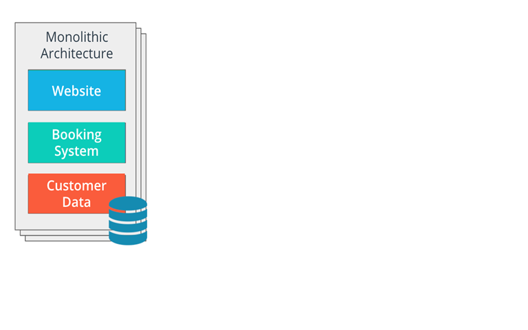
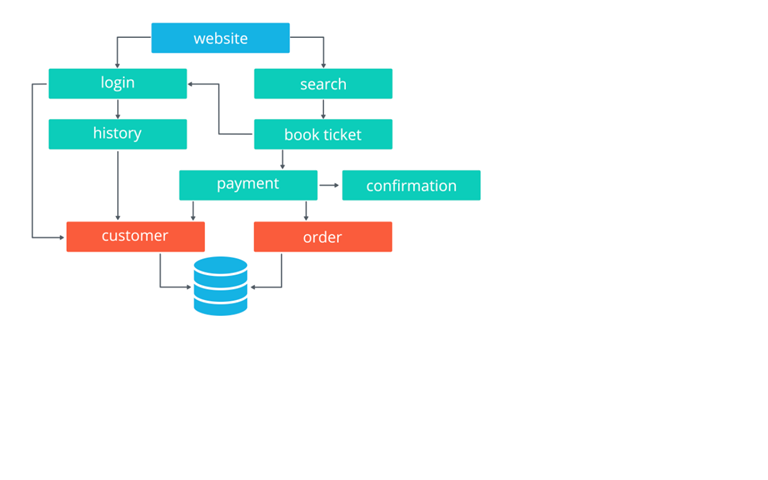
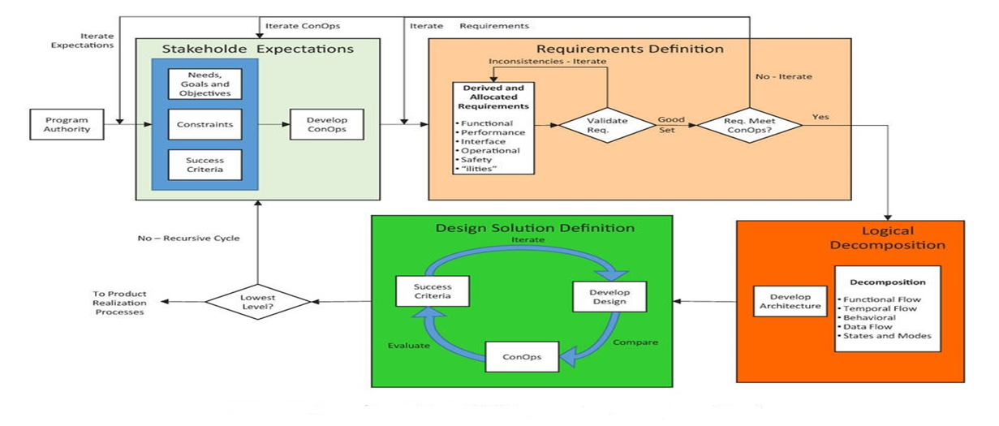
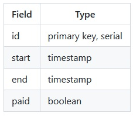
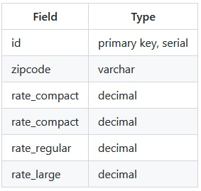
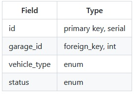
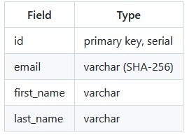
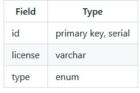
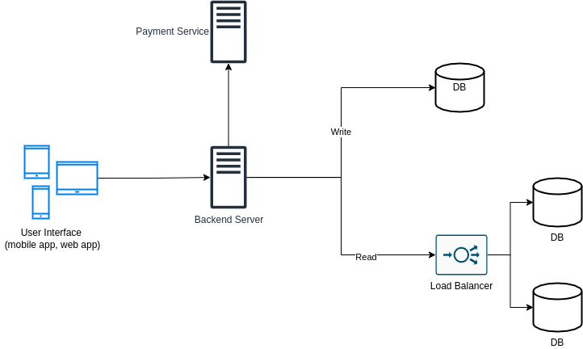

# Systems_design_lab
We are going to design a system in lab session

# Overview
#### Crucial for DevOps implementation
#### The four design processes
#### A phase of the SDLC 
#### Practical lab on system design

# 1. Definition 
Systems design is the process of defining elements of a system like modules, architecture, components and their interfaces and data for a system based on the specified requirements.

# 2. Systems design in SDLC
The systems development life cycle (SDLC) is a conceptual model used in project management that describes the stages involved in an information system development project, from an initial feasibility study through maintenance of the completed application. SDLC can apply to technical and non-technical systems.

Systems Design is a stage or component in any System Development Life Cycle (SDLC)

Most SDLC obey the following structure :
  * System development strategies
  * System specification
  * **System design**
  * Decision support
  * System verification and validation
  * System deployment, operations, and support

# 3. Systems design in DevOps 
Designing system in DevOps involves a number of technologies called in a precise order. 
The purpose is to build scalable, reliable and maintainable systems.
The technologies involved are : 
* **Docker** to containerize our systems
* **Kubernetes** for containers orchestration
* **Helm** for building charts or deployment templates
* **Argo CD, Jenkins** … to automate the deployments.

 In DevOps there is a need to move from the **Monolith Approach** to the **Micro Services Approach**. 
 - The Monolith approach considers the system with its sub systems to be part of a single resource supplier.
 In a monolithic design, application tiers can be described as:
part of the same unit
managed in a single repository
sharing existing resources (e.g. CPU and memory) 
developed in one programming language
released using a single binary

 - The Micro service approach isolates each functionality to make it stand as a service feeding on its own resources.
In a microservice design, application tiers are managed independently, as different units. Each unit has the following characteristics:
managed in a separate repository
own allocated resources (e.g. CPU and memory)
well-defined API (Application Programming Interface) for connection to other units 
implemented using the programming language of choice
released using its own binary

# 4. Systems design processes 

* Stakeholders expectations
* Requirements definition
* Logical decomposition 
* Design solution definition

# Practical lab on System Design
We are asked to design a payment and reservation system for parking garages that supports three type of vehicles (regular, large and compact). For this application we are going to mention its:

   * Requirements
   * API endpoints (public and internal)
   * Data scheme
   * Solution architecture

### Requirements gathering
With flat rate based on vehicle type and time

Note: if you've been told to design this type of system without any other requirements, the rate and special parking, is something you should ask about.
Payment and Reservation System for Parking Garages - Clarifications

Ask clarifying questions such as:

    - Who are the users and how they are going to use the system?
    - What inputs and outputs should the system support?
    - How much data do we expect the system to handle?
        - How many requests per second?

* Payment and Reservation System for Parking Garages - Requirements

    User to be able to reserve a parking spot and receive a ticket
    User can't reserve a parking spot reserved by someone else
    System to support the following types of vehicles: regular, large and compact
    System to support flat rate based on vehicle type and time the vehicle spent in the parking

* Payment and Reservation System for Parking Garages - API (Public Endpoints)

    /reserve
    
        Parameters: garage_id, start_time, end_time
        Returns: (spot_id, reservation_id)

    /cancel
    
        Parameters: reservation_id

    /payment
    
        Parameters: reservation_id
        Use existing API like Squre, PayPal, Stripe, etc.

* Payment and Reservation System for Parking Garages - API (Internal Endpoints)

    /calculate_payment - calculate the payment for reserving a parking spot
    
        Parameters: reservation_id

    /free_spots - get free spots where the car can park (note: small car might be able to park in bigger car spot)
    
        Parameters: garage_id, vehicle_type, time

    /allocate_spot - do the actual reservation of a parking spot
    
        Parameters: garage_id, vehicle_type, time

    /create_account - the ability to create an account so users can use the app and reserve parking spots
    
        Parameters: email, username, first_name (optional), last_name (optional), password (optional)

    /login
    
        Parameters: email, username (optional), password

* Payment and Reservation System for Parking Garages - Scale

We can assume that the number of users is limited to the number of parking spots in each garage and taking into account the number of garages of course.
Given that, users scale is pretty predictable and can't reach unexpected count (assuming no new garages can be added or fixed rate of new garages being added)

* Payment and Reservation System for Parking Garages - Data Scheme

SQL based database with the following tables

- Reservations

- Garages 

- Spots

- Users 

- Vehicles 

* Payment and Reservation System for parking garages - High level architecture

